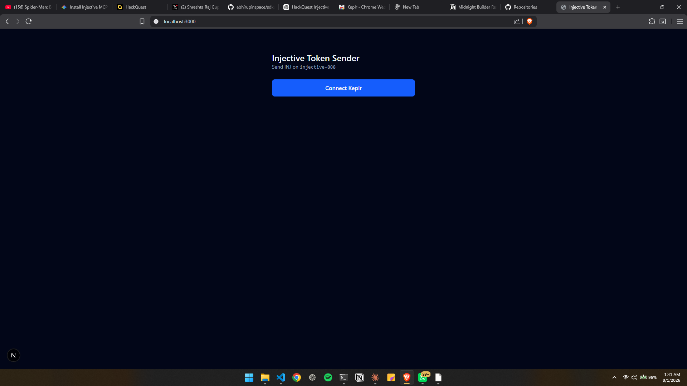
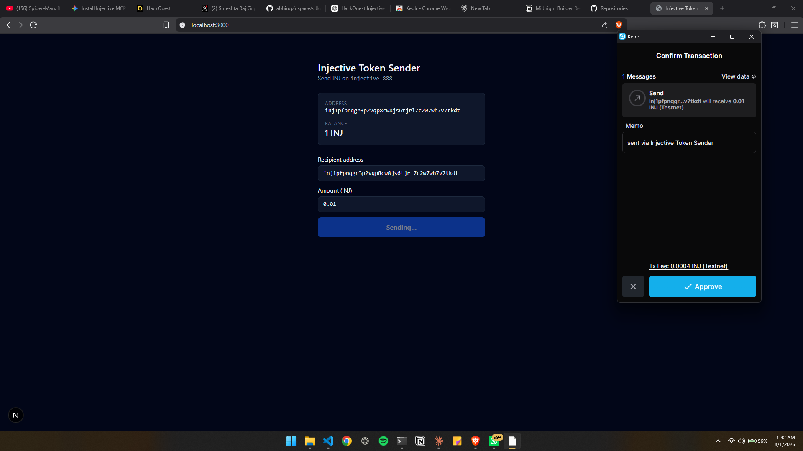
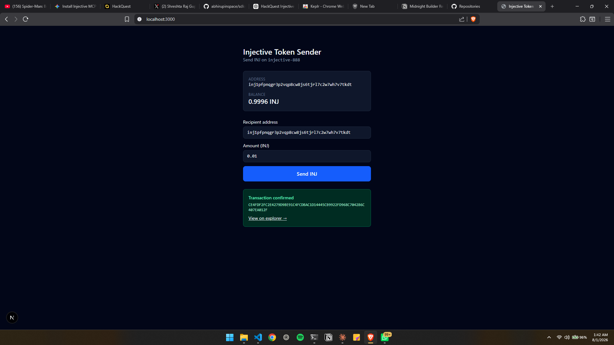

# Injective Token Sender

A deliberately small Next.js dApp that connects a Keplr wallet, reads your INJ
balance from Injective Testnet, and sends INJ to another address.

Built for the **HackQuest India × Injective Co-Learning Camp #22**.

**🔗 Live demo: [injective-token-sender.vercel.app](https://injective-token-sender.vercel.app)**
— you will need the Keplr extension and some testnet INJ to try a transfer.

There is no backend, no database and no authentication. The browser talks
directly to a public Injective LCD node, and the Keplr extension does the
signing — the app never sees a private key.

---

## What it does

1. **Connect wallet** — asks Keplr for permission on `injective-888`.
2. **Show address** — the `inj1…` address the wallet returns.
3. **Show balance** — native INJ, converted from base units to human units.
4. **Send INJ** — builds a `MsgSend`, has Keplr sign it, broadcasts it.
5. **Show the result** — the transaction hash plus an explorer link.

## Screenshots

<!-- Replace each placeholder below with your own screenshot. -->

**1. Connected wallet showing address and balance**



**2. Send form filled in, before signing**



**3. Successful transaction with hash and explorer link**



---

## Setup

Requires Node.js 20+ and the [Keplr browser extension](https://keplr.app/download).

```bash
git clone https://github.com/cyberph3onix/injective-token-sender.git
cd injective-token-sender
npm install
cp .env.example .env.local   # optional — the defaults already point at testnet
npm run dev
```

Open http://localhost:3000.

You will need testnet INJ. Get some from the
[Injective testnet faucet](https://testnet.faucet.injective.network), then make
sure Keplr is on **Injective Testnet** before clicking connect.

### Verifying the chain connection

`npm run check` queries the live testnet for a balance, an account
number/sequence and the latest block height, and asserts all three are usable.
It needs no wallet, so it is the fastest way to tell whether a failed transfer
is a chain problem or a browser problem.

```bash
npm run check                    # checks a known funded account
npm run check inj1yourAddress…   # checks yours
```

---

## Project structure

```
app/
  layout.tsx        page shell
  page.tsx          the entire UI — connect, balance, send form, result
  globals.css       Tailwind entry point
lib/
  injective.ts      all chain logic: connect, read balance, build/sign/broadcast
scripts/
  check.mjs         no-wallet smoke test for the read path
types/
  keplr.d.ts        the slice of the Keplr API this app uses
```

## Configuration

Every value is public — see `.env.example`.

| Variable | Default | Purpose |
| --- | --- | --- |
| `NEXT_PUBLIC_CHAIN_ID` | `injective-888` | Testnet chain id |
| `NEXT_PUBLIC_REST_ENDPOINT` | `https://testnet.sentry.lcd.injective.network` | LCD used for reads and broadcasting |
| `NEXT_PUBLIC_EXPLORER_URL` | `https://testnet.explorer.injective.network` | Used to build the result link |

## Tech

Next.js 15 (App Router) · React 19 · TypeScript · Tailwind CSS 4 ·
`@injectivelabs/sdk-ts` · `@injectivelabs/utils` · Keplr

---

## What I learned

**Sending a token is five steps, not one.** "Send INJ" looks like a single
action but is really: read the account's number and sequence, build a typed
message, get the wallet to sign it, broadcast the bytes, then check the result
code. Splitting `lib/injective.ts` along those five steps made the whole Cosmos
transaction model click.

**Amounts are integers.** INJ has 18 decimals, and the chain only stores whole
base units — `0.01` INJ has to be sent as `10000000000000000`. `BigNumberInBase`
and `BigNumberInWei` exist precisely because doing this with JavaScript floats
loses precision, and a factor-of-ten mistake is unrecoverable once broadcast.

**Injective accounts are not plain Cosmos accounts.** They are
`/injective.types.v1beta1.EthAccount` and use the Ethereum coin type (60, not
118) with an `ethsecp256k1` public key. Generic Cosmos signing code can build a
transaction that signs fine and then fails at `CheckTx`. `BaseAccount.fromRestApi`
and the SDK's `createTransaction` handle this — writing it by hand would not
have.

**Included in a block ≠ succeeded.** A transaction can be delivered, mined and
charged for and still have failed. Only `code === 0` means success, which is why
the app checks it explicitly instead of assuming a hash means it worked.

**A dApp doesn't need a backend.** Injective's LCD endpoints are plain HTTP and
CORS-friendly, so reads *and* broadcasting work straight from the browser. The
signing that actually needs protecting happens inside the extension, not in code
I control — which is the entire security model of a browser wallet.

**Disconnecting is local-only.** There is no connection to a blockchain to
close. "Connected" is just a fact the JavaScript remembers, which is why a page
reload resets it.

## License

MIT
